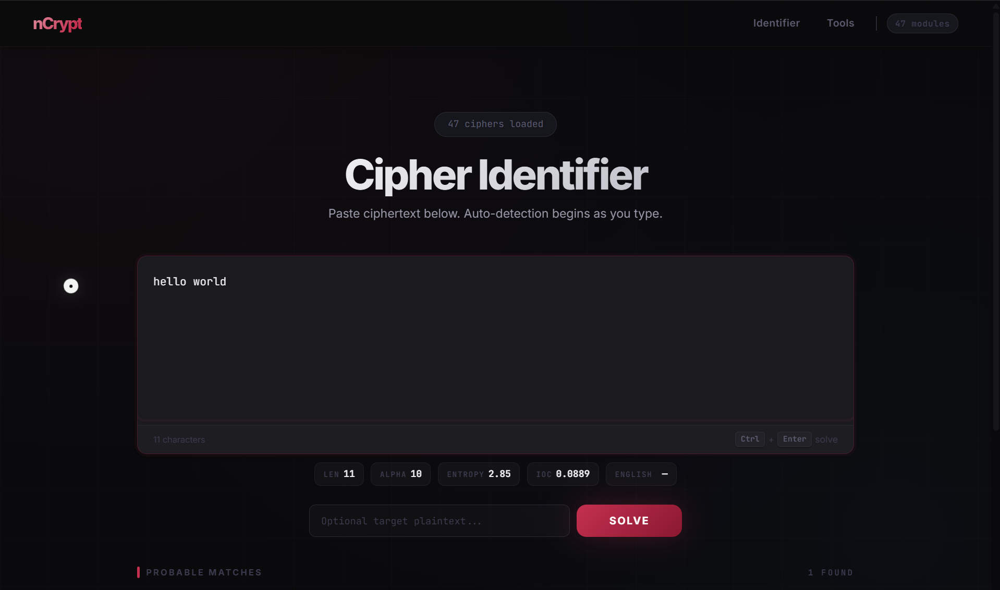
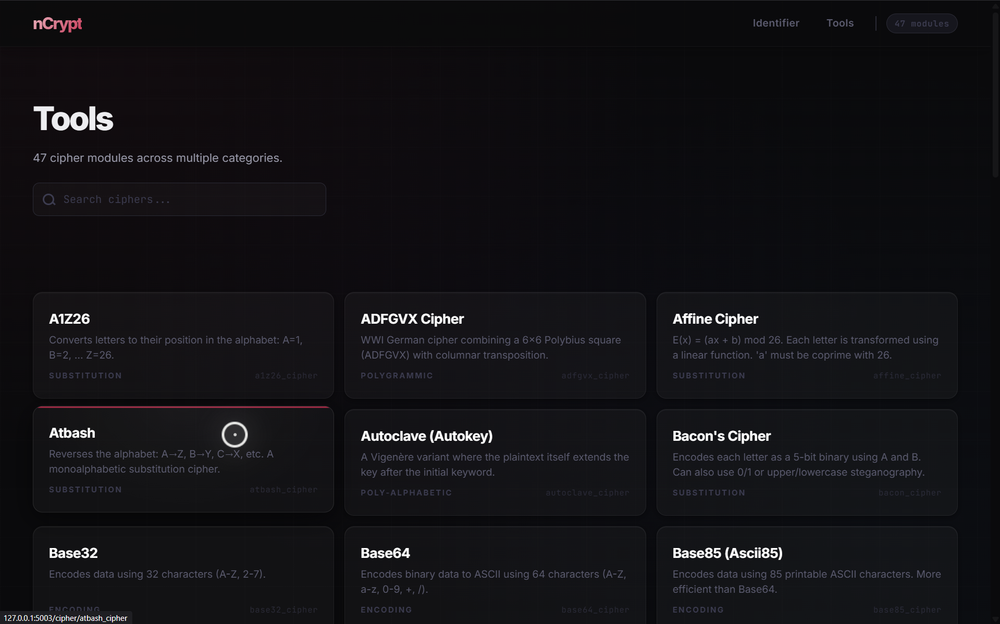
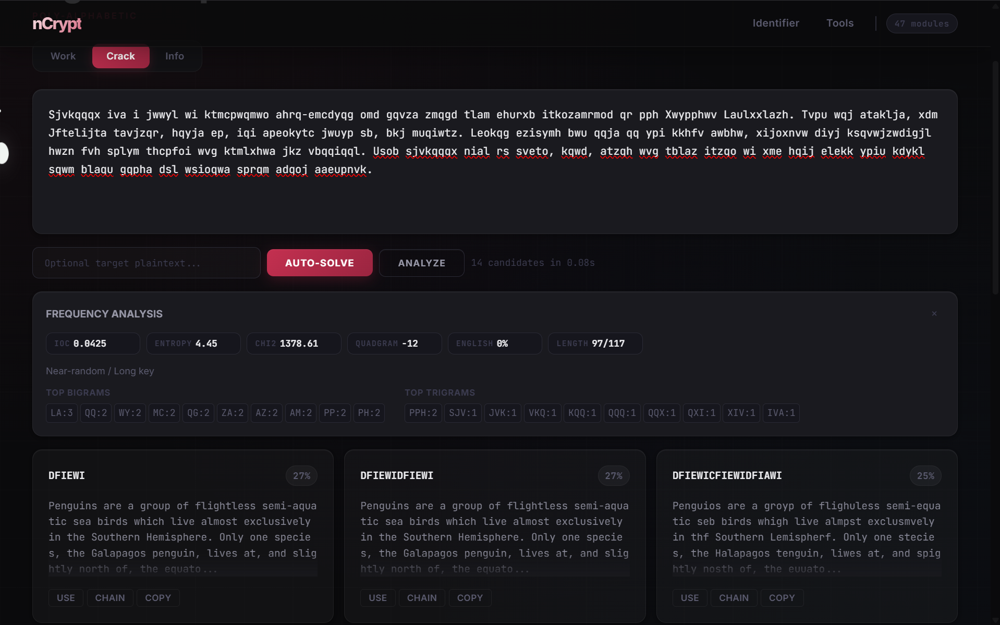

# nCrypt



nCrypt is a web-first cryptanalysis platform built on FastAPI. It combines manual cipher tooling, automated cracking, recursive multi-step solving, and optional AI-assisted candidate ranking into a single service with both a browser interface and a JSON API.

It is built for CTF workflows, puzzle solving, learning classical cryptography, and rapid ciphertext triage.

nCrypt is not a single cipher utility. It is a layered analysis system with a dynamic cipher plugin registry, a universal brute-force orchestration layer, a recursive best-first solver for chained transforms, English-likelihood scoring that blends statistical and lexical heuristics, and a browser interface with live analysis and guided solve flows.

---

## What This Project Solves

Most ciphertexts are not clean one-step transformations. nCrypt addresses a handful of practical pain points that come up over and over:

- **Unknown cipher identification** when the format is ambiguous and you are staring at a blob of text with no hints.
- **Multi-layer decoding** when one decryption step is not enough and the output still looks encoded.
- **Bruteforce** for most keyed ciphers, based on n-gram and frequency analysis.
- **Key discovery** for keyed classical ciphers where you need to search, not just guess.
- **Ranking noisy candidate plaintexts** by language plausibility so the real answer floats to the top.
- **Fast iterative workflow** from detection to testing to chaining to final plaintext, all in one place.

---

## Getting Started

### Local Setup

**Prerequisites:** Python 3.10 or higher.

1. Clone the repository:

```bash
git clone https://github.com/aaryanparveen/ncryptciphertools.git
cd ncryptciphertools
```

2. Create a virtual environment and install dependencies:

```bash
python -m venv venv
source venv/bin/activate  
pip install -r requirements.txt
```

3. Copy the example environment file and edit as needed:

```bash
cp .env.example .env
```

4. Start the server:

```bash
python app.py
```

When started with `python app.py`, it runs on `http://localhost:5000`.
If you launch with `uvicorn` directly, the port depends on your CLI flags (or `8000` by default).

### Docker

Build and run with Docker Compose:

```bash
docker-compose up --build
```

Or build the image directly:

```bash
docker build -t ncrypt .
docker run -p 8000:8000 ncrypt
```

---

## Configuration

Runtime configuration lives in `config.py` and reads from a `.env` file at the project root.

| Variable | Purpose | Required |
|---|---|---|
| `NVIDIA_API_KEY` | API key for NVIDIA-compatible OpenAI endpoint (AI-assisted solving) | No |
| `NVIDIA_MODEL` | Model identifier for AI endpoint | No |
| `SECRET_KEY` | Application secret key | No |
| `MAX_CONTENT_LENGTH` | Max accepted request size (bytes) | No |

Server host/port are currently defined in `app.py` under the `uvicorn.run(...)` call used by `python app.py`.

AI-assisted features are optional. When no API key is configured, the system falls back to engine-only mode.

---

## How It Works

### Runtime Architecture



The primary application entrypoint is `app.py`. On startup, the server:

1. Defines project-root absolute static and template paths.
2. Starts the FastAPI instance.
3. Mounts static assets.
4. Loads all cipher modules dynamically into a runtime registry.
5. Exposes both HTML routes and API routes.

The central design pattern here is the **runtime registry**. Every cipher module exports a `register` function. That function can return one cipher object or a list of them. All registered ciphers are indexed by `id` in a shared `CIPHER_REGISTRY`, and all endpoint operations resolve against that registry.

This means adding a new cipher is as simple as dropping a new module into the `ciphers` directory and implementing the expected interface. No router changes, no hardcoded imports.

### Cipher Contract

The base protocol lives in `ciphers/interface.py`. Each cipher implements a shared interface:

- `name` and `id` for identification
- `category` for grouping
- `encrypt` and `decrypt` methods
- Optional `crack` for cipher-specific automated attacks
- Optional `identify` for pattern-based detection
- Optional `generate_grid` for visual key matrix rendering
- Optional UI controls metadata for frontend form generation

Results use the `CipherResult` data class, which carries:

- `plaintext`
- `confidence` (typically a score in the `0-100` range; some AI-selected candidates are boosted above `100` for ranking)
- `key`
- `metadata`
- Serialization via `to_dict()`

This contract allows very different algorithms to feed one unified frontend and one unified API schema.

### Scoring and Language Heuristics



Statistical and lexical scoring logic is spread across `utils/analysis.py`, `utils/corpus.py`, and `utils/dictionary.py`. The scoring stack includes:

- Character frequency distributions
- Index of Coincidence (IoC)
- Entropy
- Chi-squared distance to expected English letter frequencies
- Bigram and trigram analysis
- Quadgram log-probability scoring
- Dictionary word match scoring

A few things worth noting about how the scoring behaves:

- Short texts are weighted more heavily by dictionary hit rate, since statistical measures need more data to be reliable.
- Longer texts lean on quadgram and chi-squared signals.
- Non-printable or low-alpha-ratio text is penalized.
- The system uses `cipheydists` for stronger n-gram distributions when available, with fallback n-gram tables built in for environments where that package is not installed.

This multi-factor approach is what makes candidate ranking practical when you have dozens of noisy decryption results to sort through.

### Brute-Force Orchestration

The universal brute-force engine lives in `bruteforce/engine.py`. It acts as an orchestration layer that:

1. Lazy-loads specialized brute-force modules once per process.
2. Runs each loaded specialized attack function and aggregates results.
3. Falls back to native cipher `crack` methods for registry ciphers without specialized modules (except explicitly skipped tool ciphers).
4. For shorter inputs, optionally runs dictionary-key probing on selected keyed ciphers that do not already have specialized bruteforcers.
5. Sorts by confidence, deduplicates by plaintext prefix, and returns a capped result set.

Specialized brute-force modules exist for:

| Module | Approach |
|---|---|
| `caesar_bf.py` | Exhaustive key search (26 keys) |
| `affine_bf.py` | Exhaustive coprime key pairs |
| `autoclave_bf.py` | Dictionary key probing |
| `beaufort_bf.py` | Dictionary key probing, chi-squared estimation |
| `bifid_bf.py` | Key matrix search |
| `columnar_bf.py` | Permutation search |
| `four_square_bf.py` | Key matrix optimization |
| `gronsfeld_bf.py` | Numeric key search |
| `nihilist_bf.py` | Key search with Polybius square |
| `playfair_bf.py` | Simulated annealing, hill-climbing |
| `porta_bf.py` | Dictionary key probing |
| `rail_fence_bf.py` | Exhaustive rail count search |
| `substitution_bf.py` | Hill-climbing, simulated annealing |
| `vigenere_bf.py` | Kasiski examination, chi-squared key recovery |
| `xor_bf.py` | Byte-level brute-force |

The algorithm diversity is deliberate. Different cipher families need fundamentally different search strategies, and the orchestration layer abstracts that away from the caller.

### Recursive Solver

The recursive meta-solver lives in `ciphers/recursive.py`. It is built for layered ciphertext where a single decrypt action is not sufficient.

The solver uses:

- Configurable max depth via the `key` field (default `10`)
- Tiered cipher priority sets (common encodings first, obscure ciphers later)
- Best-first search queue ordered by cumulative confidence
- Confidence-driven frontier expansion
- Time cap (`45s`) and iteration cap (`3000`) safeguards to prevent runaway searches
- Path tracing metadata so you can see exactly what chain of transforms was applied
- Deduplication of plaintext states to avoid redundant work

If your ciphertext is, say, Base64-wrapped ROT13-wrapped Morse code, the recursive solver can find that chain automatically.

### AI-Assisted Orchestration

AI integration lives in `utils/ai_solver.py`.

When `NVIDIA_API_KEY` is set in the environment:

1. The system sends top candidate packs to the configured model.
2. The model reasons about which candidate is most likely the real plaintext.
3. AI-selected candidates are marked in their metadata.
4. Recursive chaining continues if the AI output still looks encoded.

When no API key is configured, orchestration still runs and keeps high-confidence engine candidates.

### Target Plaintext Prioritization

A workflow feature worth calling out specifically: if you provide a `target_plaintext` value (a word or phrase you expect to appear in the answer), the cracking pipeline can:

- Boost any candidate containing that target text
- Raise its confidence to at least a high-priority range
- Reorder results so target hits appear first

This post-processing is applied in `/api/crack` and `/api/solve` results.

This is common in CTF tasks where you know the flag format (like `dCRyp7{`) but not the full content.

---

## API Reference

### HTML Routes

| Method | Path | Description |
|---|---|---|
| `GET` | `/` | Identifier and solve landing page |
| `GET` | `/ciphers` | Full tools catalog |
| `GET` | `/cipher/{cipher_id}` | Single-cipher workbench |

### API Endpoints

All API endpoints accept `POST` requests with JSON bodies.

#### `POST /api/analyze`

Computes identification scores across the entire cipher registry and returns ranked top candidates (score threshold `> 0.05`, top `20`).

**Request:**
```json
{
  "text": "Uryyb Jbeyq"
}
```

**Response:**
```json
{
  "results": [
    {
      "id": "rot13_cipher",
      "name": "ROT13",
      "category": "Classical",
      "score": 0.95
    }
  ]
}
```

#### `POST /api/process`

Executes direct encrypt or decrypt for a selected cipher.

**Request:**
```json
{
  "text": "Hello World",
  "cipher_id": "caesar",
  "mode": "encrypt",
  "key": "3"
}
```

#### `POST /api/crack`

Runs cipher-specific cracking with executor thread offloading (`ThreadPoolExecutor`, `max_workers=4`). Supports target plaintext prioritization.

**Request:**
```json
{
  "text": "Khoor Zruog",
  "cipher_id": "caesar",
  "target_plaintext": "Hello World"
}
```

#### `POST /api/bruteforce`

Invokes the universal brute-force orchestration layer across specialized and fallback attacks, then returns ranked unique candidates.

**Request:**
```json
{
  "text": "Khoor Zruog"
}
```

#### `POST /api/solve`

Unified solver endpoint. Can run recursive mode or brute-force mode.

Use an explicit `mode` value of `recursive` or `bruteforce` in this endpoint.

**Request:**
```json
{
  "text": "some layered ciphertext",
  "mode": "recursive"
}
```

#### `POST /api/ai_solve`

AI-assisted solve orchestration. Uses NVIDIA AI evaluation when `NVIDIA_API_KEY` is configured; otherwise falls back to engine-driven ranking.

**Request:**
```json
{
  "text": "some ciphertext",
  "target_plaintext": "dCRyp7{" 
}
```

#### `POST /api/auto_process`

Quick triage with top crack previews. Good for a first pass at unknown text.

#### `POST /api/frequency`

Returns frequency analysis data including IoC, entropy, chi-squared, quadgram fitness, English score, and top n-grams.

**Request:**
```json
{
  "text": "Some text to analyze"
}
```

#### `POST /api/render_grid`

Generates visual grid data for ciphers that use key matrices or squares (Playfair, Four Square, Polybius, etc.).

### Request Model

The shared `TextInput` model accepts:

| Field | Type | Description |
|---|---|---|
| `text` | string | The input ciphertext or plaintext |
| `cipher_id` | string (optional) | Target cipher identifier |
| `mode` | string (optional) | For `/api/process`: `encrypt` or `decrypt`; for `/api/solve`: `recursive` or `bruteforce` |
| `key` | string (optional) | Cipher key |
| `target_plaintext` | string (optional) | Known phrase for prioritization |
| `ai_assist` | boolean (optional) | Compatibility field (current backend logic does not branch on this flag) |
| `debug` | boolean (optional) | Include debug metadata in response |

---

## Cipher Catalog

nCrypt ships with the following cipher modules. Each one is loaded dynamically at startup from the `ciphers` directory.

| Module | Category | Notes |
|---|---|---|
| `a1z26.py` | Encoding | Letter-number substitution |
| `adfgvx.py` | Classical | WWI-era fractionating cipher |
| `affine.py` | Classical | Linear algebra substitution |
| `atbash.py` | Classical | Reverse alphabet substitution |
| `autoclave.py` | Classical | Self-keying Vigenere variant |
| `bacon.py` | Classical | Baconian biliteral cipher |
| `base32_enc.py` | Encoding | Base32 encode/decode |
| `base64_enc.py` | Encoding | Base64 encode/decode |
| `base85_enc.py` | Encoding | Base85/Ascii85 encode/decode |
| `base_n.py` | Encoding | Generic base-N conversions |
| `beaufort.py` | Classical | Reciprocal Vigenere variant |
| `bifid.py` | Classical | Polybius-based fractionating cipher |
| `binary.py` | Encoding | Binary encode/decode |
| `book_cipher.py` | Classical | Reference-based substitution |
| `caesar.py` | Classical | Shift cipher |
| `columnar.py` | Classical | Columnar transposition |
| `decimal.py` | Encoding | Decimal encode/decode |
| `esoteric.py` | Encoding | Esoteric encoding systems |
| `four_square.py` | Classical | Four-square polygraphic cipher |
| `gronsfeld.py` | Classical | Numeric-key Vigenere variant |
| `hashes.py` | Modern | Hash identification and generation |
| `hex.py` | Encoding | Hexadecimal encode/decode |
| `hill.py` | Classical | Matrix-based polygraphic cipher |
| `keyed_classic.py` | Classical | Keyed alphabet substitution |
| `modern.py` | Modern | Modern symmetric cipher wrappers |
| `morse.py` | Encoding | Morse code |
| `nihilist.py` | Classical | Nihilist substitution cipher |
| `octal.py` | Encoding | Octal encode/decode |
| `playfair.py` | Classical | Digraphic substitution |
| `polybius.py` | Classical | Polybius square |
| `porta.py` | Classical | Porta polyalphabetic cipher |
| `rail_fence.py` | Classical | Rail fence transposition |
| `recursive.py` | Meta | Recursive/layered encoding detection |
| `reverse_text.py` | Encoding | Text reversal |
| `rot13.py` | Classical | ROT13 (Caesar with key 13) |
| `rot47.py` | Classical | ROT47 (ASCII rotation) |
| `rot_variants.py` | Classical | Other rotation variants |
| `substitution.py` | Classical | General monoalphabetic substitution |
| `tap_code.py` | Encoding | Tap/knock code |
| `url_encoding.py` | Encoding | URL percent encoding |
| `uuencode.py` | Encoding | UUencode |
| `vigenere.py` | Classical | Vigenere polyalphabetic cipher |
| `xor.py` | Modern | XOR cipher |

---

## Dependencies

**Core (in `requirements.txt`):**

- `fastapi` - web framework
- `uvicorn` - ASGI server
- `jinja2` - template engine
- `python-dotenv` - environment variable loading
- `python-multipart` - form data parsing
- `numpy` - numerical operations for scoring
- `openai` - AI endpoint client
- `cipheydists` - n-gram distribution data
- `a2wsgi` - ASGI-to-WSGI adapter for PythonAnywhere compatibility

**Optional behavior:**

- If `cipheydists` is not installed, built-in fallback n-gram tables are used. Scoring still works, just with slightly less refined distributions.
- Modern cipher wrappers may require `cryptography` or `pycryptodome` depending on which modern ciphers you use.

---

